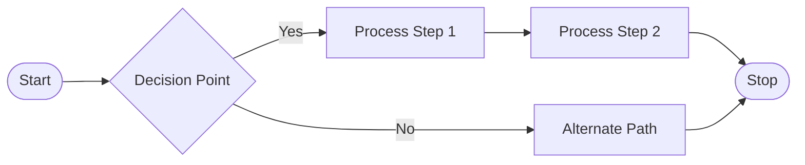
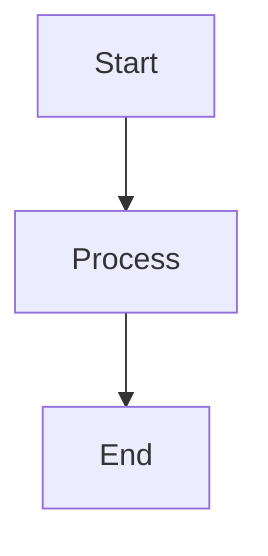
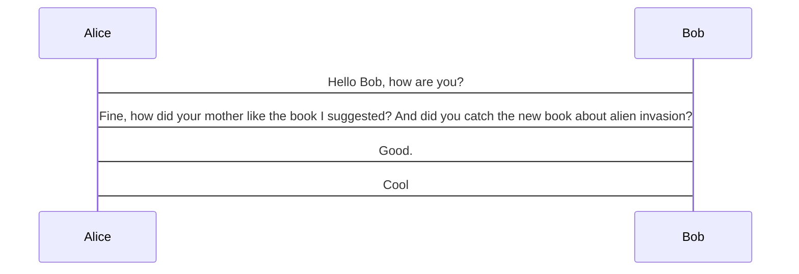
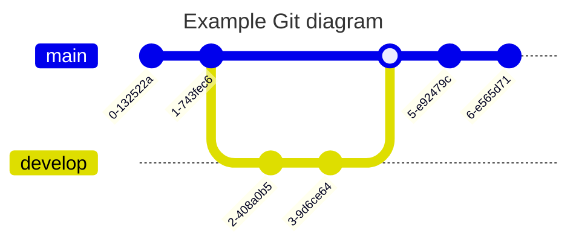
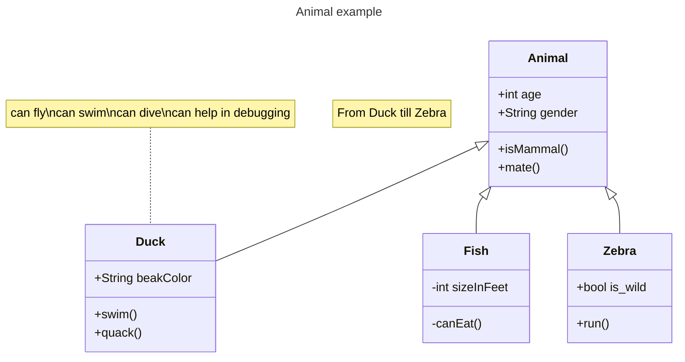
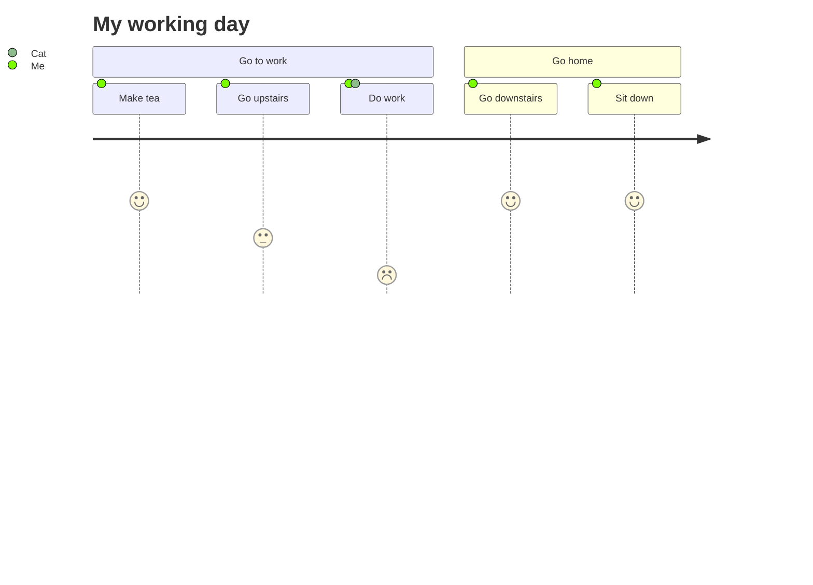
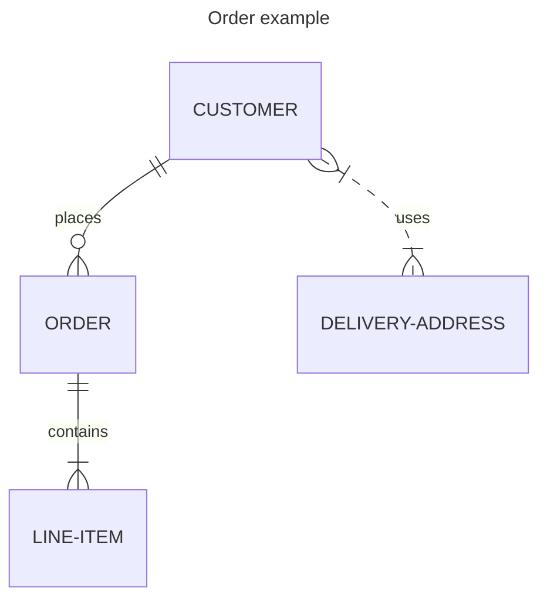
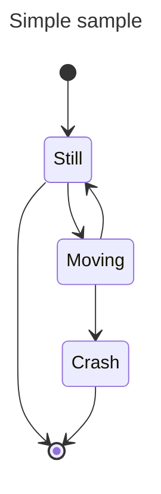

MyLittleContentEngine is a powerful static site generator designed specifically for .NET Blazor applications. It enables developers to create content-rich websites, blogs, and documentation sites using markdown content with strongly-typed front matter, advanced code highlighting, and seamless static HTML generation.



graph



more



git


class diagram



journey


er diagram




state diagram


## What Makes It Different

- **Strongly Typed**: Type-safe front matter and content models with full IntelliSense support
- **Blazor Native**: Built specifically for Blazor Server and WebAssembly applications
- **Developer Experience**: Hot reload during development with compile-time checking
- **Advanced Code Highlighting**: Roslyn integration for live syntax highlighting of connected .NET solutions
- **Performance Focused**: Efficient caching and static generation for fast loading times

## Core Features

### Content Management
- Markdown-based content with YAML front matter
- Hierarchical content organization
- Built-in tag system with automatic cross-references
- Draft support for content staging
- Automatic table of contents generation

### Static Site Generation
- Conditional build modes (development server vs. static generation)
- Automatic route discovery and HTML generation
- Asset copying and optimization
- SEO-ready with sitemap.xml and RSS feed generation

### Styling Integration
- MonorailCSS support for utility-first styling
- Automatic CSS class detection and generation
- Configurable color themes and palettes
- Performance-optimized CSS delivery

### Code Highlighting
- Roslyn-powered syntax highlighting for .NET code
- TextMate grammar support for other languages
- Tabbed code blocks for multi-language examples
- Custom highlighter support (GBNF, shell, etc.)

## Getting Started

The best way to learn MyLittleContentEngine is to follow our step-by-step tutorials:

1. **[Creating Your First Site](tutorials/creating-first-site.md)** - Set up a basic content site
2. **[Getting Started Guide](tutorials/getting-started.md)** - Learn the fundamentals
3. **[Adding Blog Posts](tutorials/adding-blog-posts.md)** - Create and manage blog content

## Documentation Structure

This documentation follows the [Diátaxis framework](https://diataxis.fr/) to provide you with the right information at the right time:

### 📚 [Tutorials](tutorials/index.md)
Step-by-step learning-oriented guides that take you through the process of creating real applications with MyLittleContentEngine.

### 🛠️ [How-To Guides](how-to/index.md) 
Problem-solving guides that show you how to accomplish specific tasks and overcome common challenges.

### 💡 [Explanation](explanation/index.md)
Understanding-oriented discussions that clarify concepts, design decisions, and the reasoning behind MyLittleContentEngine's architecture.

### 📖 [Reference](reference/index.md)
Information-oriented technical reference for APIs, configuration options, and detailed specifications.

## Quick Example

Here's a minimal setup to get you started:

```csharp
// Program.cs
builder.Services.AddContentEngineService(() => new ContentEngineOptions
{
    BlogTitle = "My Site",
    BlogDescription = "Powered by MyLittleContentEngine",
    BaseUrl = "https://mysite.com",
});

builder.Services.AddContentEngineStaticContentService<MyFrontMatter>();
```

```yaml
# Content/Blog/my-first-post.md
---
title: "Hello World"
description: "My first post"
date: 2025-01-01
tags:
  - introduction
---

Welcome to my new site powered by MyLittleContentEngine!
```

Ready to dive in? Start with [Creating Your First Site](tutorials/creating-first-site.md) or explore the specific area that interests you most.