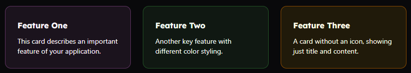

While working on my content engine, [MyLittleContentEngine](https://phil-scott-78.github.io/MyLittleContentEngine/), a .NET-based static site generator, I found myself wanting to add richer components to the documentation. I could write entire pages as Razor pages, but that felt like overkill for content that's primarily Markdown.

Many documentation engines are JavaScript-based, so they can rely on MDX files to run JavaScript JSX components within Markdown documents. That sounded useful, but MyLittleContentEngine is .NET-based and uses Markdig.

Enter [**Mdazor**](https://github.com/phil-scott-78/Mdazor) - a Markdig extension that lets you embed real Blazor components directly inside your Markdown documents.


## What Mdazor Does

Mdazor is a custom Markdig extension that parses component-like tags in your Markdown and renders them as actual Blazor
components. Here's a simple example:

```markdown
# My Documentation

Here's some regular markdown content.

<MyComponent Name="World" Count="42">
This is **markdown content** inside the component!
</MyComponent>

More regular markdown here.
```

When processed, the `<MyComponent>` tag gets replaced with the actual rendered output of your Blazor component, complete
with any parameters you've specified.

## Key Features

The extension provides several compelling features:

- **Real Blazor Components**: These aren't fake components or static renderings - they're actual Blazor components using
  server-side rendering
- **Parameter Mapping**: Component parameters are automatically mapped from attributes using reflection
- **Nested Markdown**: Content inside component tags is processed as Markdown, so you can use formatting, links, and other Markdown features

## Technical Implementation

The heart of Mdazor is a custom Markdig extension that intercepts component-like tags during the parsing phase. Here's
how it works:

1. **Tag Detection**: The parser identifies tags that look like components (capitalized tag names)
2. **Component Resolution**: It attempts to resolve the component type from a pre-registered collection
3. **Parameter Mapping**: Attributes are mapped to component parameters using reflection
4. **Content Processing**: Any content inside the component tags is recursively processed as Markdown
5. **Rendering**: The component is rendered server-side and the HTML output replaces the original tag using the [HtmlRenderer](https://learn.microsoft.com/en-us/dotnet/api/microsoft.aspnetcore.components.web.htmlrenderer?view=aspnetcore-9.0) class.

The trickiest part was handling nested content correctly. Since Markdown can contain components, and components can
contain Markdown, you need careful recursive processing to avoid infinite loops or incorrect parsing.

## Real-World Usage

Let's say we want a reusable call-to-action link component with an icon, title, and href.

We can define it as a Blazor component:

```razor
<a href="@Href">
    <div class="group h-full relative rounded-xl border border-@Color-200 dark:border-@Color-900  bg-@Color-200/50 hover:bg-@Color-500/20 dark:bg-@Color-500/10 dark:hover:bg-@Color-600/20 ">
        <div class="relative flex flex-row gap-x-4 overflow-hidden rounded-xl p-6">
            @if (Icon != null)
            {
                <div class="pt-1 text-@Color-700 dark:text-@Color-500 fill-@Color-200 dark:fill-@Color-950">
                    @Icon
                </div>
            }
            <div>
                <h2 class="font-display font-bold text-@Color-900 dark:text-@Color-50 pb-2" >@Title</h2>
                <div class="text-sm">
                    @ChildContent
                </div>
            </div>
        </div>
    </div>


</a>

@code {
    [Parameter] public RenderFragment? ChildContent { get; set; }
    [Parameter] public RenderFragment? Icon { get; set; }
    [Parameter] public string? Title { get; set; }
    [Parameter] public string? Href { get; set; }
    [Parameter] public string Color { get; set; } = "primary";
}
```

Here we have three straightforward properties: `Title`, `Href`, and `Color`. `Icon` is a `RenderFragment` which allows us to pass HTML when defining the properties. The final property is [ChildContent](https://learn.microsoft.com/en-us/aspnet/core/blazor/components/?view=aspnetcore-9.0#child-content-render-fragments), which by convention defines the `RenderFragment` for the body content of the component.

To use it, we first register the component with our service provider in `Program.cs`:

```csharp
services.AddMdazor()
    .AddMdazorComponent<LinkCard>();
```

Once it is registered, we need to also add Mdazor to the Markdig pipeline:

```csharp
var pipeline = new MarkdownPipelineBuilder()
    .UseMdazor(serviceProvider)
    .Build();
var html = Markdown.ToHtml(markdownContent, pipeline);
```

Note that we're injecting a service provider. We not only resolve components via DI, but Mdazor also supports the `@inject` directive to inject services into Mdazor components.

Once we've done the infrastructure plumbing, we're ready to use the components in our Markdown documents:

```markdown

## Welcome to My Site

Click these links to find out *even more*!

<LinkCard title="Getting Started" href="/getting-started">
<Icon>
<svg xmlns="http://www.w3.org/2000/svg" viewBox="0 0 24 24"  width="2em" height="2em" stroke="currentColor">
    <path d="M13.7276 3.44418L15.4874 6.99288C15.7274 7.48687 16.3673 7.9607 16.9073 8.05143L20.0969 8.58575C22.1367 8.92853 22.6167 10.4206 21.1468 11.8925L18.6671 14.3927C18.2471 14.8161 18.0172 15.6327 18.1471 16.2175L18.8571 19.3125C19.417 21.7623 18.1271 22.71 15.9774 21.4296L12.9877 19.6452C12.4478 19.3226 11.5579 19.3226 11.0079 19.6452L8.01827 21.4296C5.8785 22.71 4.57865 21.7522 5.13859 19.3125L5.84851 16.2175C5.97849 15.6327 5.74852 14.8161 5.32856 14.3927L2.84884 11.8925C1.389 10.4206 1.85895 8.92853 3.89872 8.58575L7.08837 8.05143C7.61831 7.9607 8.25824 7.48687 8.49821 6.99288L10.258 3.44418C11.2179 1.51861 12.7777 1.51861 13.7276 3.44418Z"  stroke-width="1.5" stroke-linecap="round" stroke-linejoin="round"></path>
</svg>
</Icon>
Learn the basics of setting up your documentation site.
</LinkCard>
```

This will render as:


## Nested Components

Let's say we want to display multiple cards in a row. We can create a `CardGrid.razor` component:

```razor
<div class="not-prose mt-6 mb-8 grid grid-cols-1 gap-6 sm:grid-cols-@Columns">
    @ChildContent
</div>

@code {
    [Parameter] public string Columns { get; set; } = "2";
    [Parameter] public RenderFragment? ChildContent { get; set; }
}
```

This is even simpler. Here we're wrapping the child content in a single `div` with CSS Grid styling. The `Columns` property lets users decide how many columns the grid will have.

Update the registration to include our new component:

```csharp
services.AddMdazor()
    .AddMdazorComponent<LinkCard>()
    .AddMdazorComponent<CardGrid>();
```

Then we can use it:

```markdown

Here's a three-column grid example:

<CardGrid Columns="3">
<Card Title="Feature One" Color="tertiary-one">
This card describes an important feature of your application.
</Card>

<Card Title="Feature Two" Color="tertiary-two">
Another key feature with different color styling.
</Card>

<Card Title="Feature Three" Color="yellow">
A card without an icon, showing just title and content.
</Card>
</CardGrid>
```

This will render:



## Limitations and Considerations

I've only started experimenting with this, so there are plenty of areas for improvement:

- **Server-Side Only**: Currently only works with server-side rendering
- **Parameter Types**: Only basic parameter types are supported. Complex objects need additional serialization logic
- **Single-Line Definitions**: Currently you can't split component properties across multiple lines
- **Whitespace Handling**: Markdown's whitespace rules can sometimes conflict with component rendering expectations. Best practice is to keep all Mdazor component parts, even nested ones, unindented. This is especially important when working with whitespace-dependent Markdown like blockquotes or code blocks
- **Minimal Testing**: This is just something I built for my own purposes. There are surely edge cases not covered, so buyer beware

## Conclusion

Mdazor represents a bridge between the simplicity of Markdown and the power of Blazor components. While it started as a skunkworks project for my static site generator, it's proven invaluable for creating rich, interactive documentation.

Thanks to Andrew Lock for [this article](https://andrewlock.net/exploring-the-dotnet-8-preview-rendering-blazor-components-to-a-string/) which explains how to get HtmlRenderer working. 
