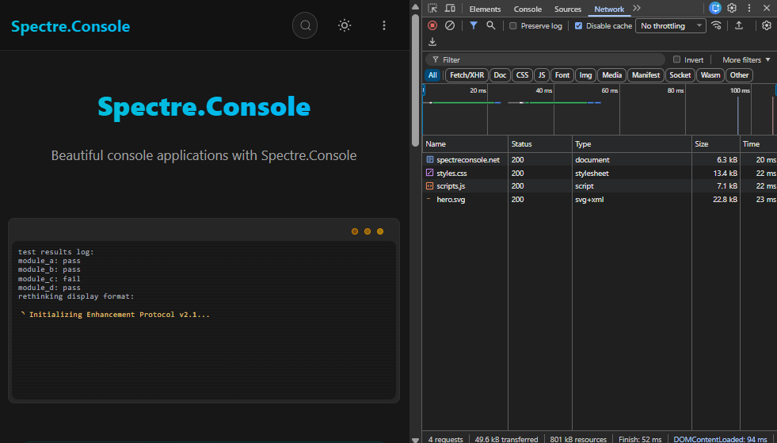

[Statiq](https://statiq.dev), our static site generator, was showing its age. We're pushing [Spectre.Console](https://spectreconsole.net) toward 1.0, and our documentation engine wasn't keeping up. Time for something new.

I looked at the usual suspects: Docusaurus, DocFX, VitePress, Astro Starlight. They're fine tools. But they all come with the same baggage: the JavaScript build toolchain. You know the drill - `node_modules` folders that dwarf your actual content, hundreds of dependencies to keep current, fighting with pnpm or npm, maintaining JSON or YAML configuration files. For a .NET library, it felt like dragging in a whole different ecosystem just to write docs.

So I did what any reasonable developer would do: I built my own documentation engine.

Actually, I built several tools. Rebuilding the Spectre.Console docs became the perfect opportunity to validate all of them in a real-world project.

## What I Built

The new Spectre.Console documentation is live at [spectreconsole.net](https://spectreconsole.net). Some highlights:

**Performance That Actually Matters**: The typical page weighs in around 50KB total (HTML, CSS, and JavaScript combined). For comparison, the [MS Learn page for Blazor components](https://learn.microsoft.com/en-us/aspnet/core/blazor/components/?view=aspnetcore-10.0) transfers 2.8MB of data. That's not a typo - it's fifty-six times larger. And their syntax highlighting doesn't even always work properly.

**Animated Console Output**: Using [VCR#](https://github.com/phil-scott-78/vcr), a library I wrote for capturing console output, we generate animated SVGs instead of GIFs or screenshots. They're crisp, scalable, support transparent backgrounds, and work perfectly in both light and dark modes.

**Code Samples That Actually Compile**: Through the xmldocid feature, code samples are pulled directly from compiled assemblies. This means every code example on the docs site is guaranteed to compile and actually work. No more copy-paste errors or examples that drift out of sync with the actual API.

**Auto-Generated API Documentation**: Reference documentation is generated directly from .NET assemblies using Roslyn, with full XML documentation support and semantic syntax highlighting.

**Built-In Search**: FlexSearch-powered search with the index built at build time. No waiting for client-side indexing or third-party services.

And all of this? Pure .NET. Zero JavaScript build tools. No YAML or JSON. Just `dotnet watch` and you're good to go.

## The Stack

Zero Node.js. Just .NET all the way down.

**[MyLittleContentEngine](https://github.com/phil-scott-78/MyLittleContentEngine)**: The heart of the system. It's a static site generator built on Blazor that handles markdown processing, navigation generation, and the build pipeline. Think of it as Blazor for documentation - you get the full power of ASP.NET and Razor components, but everything renders to static HTML at build time.

**[MonorailCSS](https://github.com/phil-scott-78/MonorailCss)**: A Tailwind-style utility CSS framework, but written in .NET. No PostCSS, no PurgeCSS, no Node.js. You give it the CSS classes and it generates exactly the CSS you need.

**[VCR#](https://github.com/phil-scott-78/vcr)**: Captures console output and saves it as animated SVG files. Because Spectre.Console is all about beautiful console applications, we needed a way to show that beauty in the docs. VCR# runs the examples and records them automatically.

**[Mdazor](https://github.com/phil-scott-78/Mdazor)**: Like MDX for .NET - it lets you embed Razor components directly in Markdown. Need a complex interactive element or a specialized layout? Just drop in a component.

**Roslyn**: Microsoft's C# and VB.NET compiler platform provides semantic syntax highlighting. Not regex-based parsing - actual compiler-level understanding of the code. As C# evolves and new language features are added, the highlighting automatically supports them. With Roslyn integrated, we can also pull API reference right from the code.

I'm aware that's a lot of libraries. Each one solved a specific problem, and then that solution created new possibilities, which led to more tools, and... okay, maybe I have a problem. But they all work together beautifully.

## How It Works

The most validating part of this project was how easy it was to work with. You run `dotnet watch`, and everything just works. Edit markdown content? Instant reload. Change a code sample in one of the example projects? Reload. Tweak a Razor component? Reload. Adjust the theme or CSS? Reload.

### The xmldocid Magic

This is probably my favorite feature. Instead of copying code into markdown files, you write actual C# projects with real, compiled code. Then in your documentation, you reference methods by their XML documentation ID:

`````markdown
```csharp:xmldocid,bodyonly
M:Spectre.Docs.Examples.SpectreConsole.Reference.Live.ProgressExamples.BasicProgressExample
```
`````

That `M:` syntax is the standard [.NET XML documentation ID format](https://learn.microsoft.com/en-us/dotnet/csharp/language-reference/xmldoc/) - `M:` for methods, `T:` for types. When the documentation builds, it uses Roslyn to crack open the compiled assembly, find that exact method, and pull out the source code. The `bodyonly` option shows just the method body without the signature, perfect for when you want to focus on the implementation. For more options, check the [MyLittleContentEngine documentation on Connecting to Roslyn](https://phil-scott-78.github.io/MyLittleContentEngine/getting-started/connecting-to-roslyn).

The benefit is huge: your code examples are real code. They compile. They run. They can't drift out of sync because they're literally the same code your users would write.

And if you refactor your API, your documentation updates automatically.

On the [Progress Display page](https://spectreconsole.net/console/live/progress), it all comes together. The [Markdown](https://raw.githubusercontent.com/spectreconsole/website/refs/heads/main/Spectre.Docs/Content/console/live/progress.md) only contains content, not code samples. The [code samples](https://github.com/spectreconsole/website/blob/main/Spectre.Docs.Examples/SpectreConsole/Reference/Live/Progress.cs) are part of a Console application. All compileable, all runnable, ensuring that what is displayed is valid.

That page demonstrates everything working together - the animated SVG showing the actual console output, multiple code samples pulled via xmldocid, cross-references between pages, and an Mdazor component generating the API reference section. All from a fairly simple markdown file with some special syntax.

The design philosophy here is important: you structure your sample code intentionally to be documentation-friendly. Instead of having one giant example with a bunch of setup code, you break it into focused methods that each demonstrate one concept. Your samples become more maintainable, and your docs become better.

### Mdazor and Auto-Generated Reference Lists

xmldocid solved code samples, but what about exhaustive reference lists? Spectre.Console has dozens of colors, multiple spinner styles, various table border options, emoji shortcodes - the kind of content that's tedious to write manually and even worse to keep updated. Miss one new color in a release, and your docs are out of sync.

This is where Mdazor shines. While Mdazor's primary purpose is embedding Blazor components in Markdown (covered in detail in the [MyLittleContentEngine documentation](https://phil-scott-78.github.io/MyLittleContentEngine/guides/markdown-extensions#blazor-within-markdown)), we use it in the Spectre.Console docs for something more powerful: reflection-based components that auto-generate documentation. The syntax is simple - just drop a component tag in your markdown: `<ColorList />`. But at build time, these components use .NET reflection to scan the Spectre.Console assembly and generate complete reference documentation.

Take the [color reference page](https://spectreconsole.net/console/reference/color-reference) as an example. The [ColorList component](https://github.com/spectreconsole/website/blob/main/Spectre.Docs/Components/Reference/ColorList.razor) scans the assembly for all static Color properties, then renders each one with its name, hex value, and a visual preview. When someone adds a new color to Spectre.Console and cuts a release, the documentation updates automatically on the next build. No manual work, no risk of forgetting to document something.

The most sophisticated example is WidgetApiReference. It generates complete API documentation - constructors, properties, methods, even extension methods defined in other assemblies. It uses reflection to discover the structure of a type, then combines that with XML documentation parsing to create comprehensive reference pages. You can see it in action on widget documentation pages like the [Table widget](https://spectreconsole.net/console/widgets/table).

This embodies the "pure .NET" approach that runs through the entire project. No JavaScript build tool can introspect .NET assemblies the way .NET itself can. The documentation can't drift out of sync because it's generated directly from the source of truth: the compiled assembly. When the code changes, the docs change. Automatically.

Beyond reflection-based components, Mdazor also provides authoring components similar to what you'd find in Astro Starlight - Cards for layout, Steps for tutorials, Badges for callouts. These make writing documentation nicer without needing to drop into raw HTML. The [MyLittleContentEngine documentation](https://phil-scott-78.github.io/MyLittleContentEngine/guides/markdown-extensions#blazor-within-markdown) has the full list of available components and examples of how to use them.

### VCR# and Console Output

When I was working on the Spectre.Console docs, I needed to show console output. But GIFs and screenshots have problems:

- **Size**: Animated GIFs for high-quality console output get big fast
- **Quality**: Screenshots lose fidelity, especially with colors and effects
- **Theming**: If you want to support light and dark modes, you need separate captures for each
- **Flexibility**: Want to tweak the background color? Regenerate everything

SVGs solve all of this. VCR# works by hosting ttyd (a web-based terminal emulator) in a local ASP.NET site. When we run .NET console applications from the `Spectre.Docs.Examples` and `Spectre.Docs.Cli.Examples` directories, VCR# captures the actual output and converts it to SVG.

The powerful part: instead of relying on font characters to render things like panels, borders, and progress bars, VCR# uses SVG geometric shapes - actual lines and rectangles.

This turned out to be critical because different browsers render ASCII art characters inconsistently. Some browsers use different fonts, some have spacing issues. By using SVG primitives, we get pixel-perfect rendering across every browser and platform.

The result is crisp at any resolution, supports transparent backgrounds, and can be styled with CSS. Light mode and dark mode can use slightly different background colors without regenerating anything - the browser just applies different stylesheets.

Simple, elegant, and it works beautifully.

### MonorailCSS Integration

Getting MonorailCSS working smoothly came down to solving one challenge: parsing and scanning for class usage across all your Razor components and Markdown files.

The solution I landed on was to build it as part of the ASP.NET middleware process. As the site renders during development, MonorailCSS middleware keeps a running list of utility classes it encounters. Then, using `app.MapGet`, I hook into the `styles.css` endpoint.

When the browser requests `styles.css`, MonorailCSS generates the stylesheet on the fly based on all the CSS classes the middleware has seen. It's like Tailwind's JIT mode, but integrated directly into the ASP.NET pipeline - no file watchers, no separate build process.

During the production build (when you run `dotnet run --configuration Release -- build`), this dynamic CSS gets frozen into a static `styles.css` file alongside the generated HTML. The middleware approach is development-only, giving you the fast feedback loop during authoring while still producing optimized static assets for deployment.

Why not just use Tailwind? Because I wanted to avoid the Node.js dependency entirely. With MonorailCSS, the CSS is dynamically generated as part of your normal ASP.NET request pipeline. No extra toolchain, no package.json, no worrying about keeping PostCSS and PurgeCSS up to date.

### Search

For search, I initially tried the usual suspects. I experimented with client-side indexing (build the index when someone first visits) and third-party services like Algolia. But then I realized something obvious: we're already building the entire site server-side. Why not build the search index server-side too?

So that's what MyLittleContentEngine does. During the build process, it generates a complete [FlexSearch](https://github.com/nextapps-de/flexsearch) (a JavaScript full-text search library) index as a JSON file. The search experience is fast because the index is prebuilt, and it's simple because there's no complex integration or API keys to manage.

### Performance



The performance goal was baked in from day one. I wanted to keep pages under 100KB total, ideally closer to 50KB. We accomplished this through three key strategies:

**Lazy-load third-party JavaScript**: We never load third-party libraries until they're actually needed. FlexSearch only loads when you click the search button. Syntax highlighting uses Roslyn for C# (server-side, zero client JavaScript) and TextMate grammars for other languages (also server-side). Client-side highlighting libraries like highlight.js are only used as a last resort fallback.

**Generate only the CSS you use**: MonorailCSS scans all your components and markdown files during the build, tracking which CSS classes are actually used. The generated `styles.css` file contains only those classes - nothing more. No unused utility classes bloating your stylesheet.

**Compress assets at build time**: The GitHub Pages deployment automatically compresses CSS and JavaScript files. Combined with the minimal JavaScript footprint, pages load fast even on slower connections.

By rendering everything server-side and only shipping the absolute minimum JavaScript, we hit those 50KB targets easily. Every kilobyte of JavaScript you ship makes the page slower, especially on mobile connections.

## The Migration Experience

I took the opportunity of the rebuild to do a manual rewrite of the content. Instead of trying to automate a migration from Statiq, I went through each page, improved the writing, updated examples, and restructured things to work better. It was more work upfront, but the result is much better documentation.

The big win? Writing code samples in the IDE instead of markdown code blocks. I could write the examples in Visual Studio, get full IntelliSense, compile them to catch errors, run them to verify the output, and then just reference them via xmldocid. The tedious parts of documentation - making sure code actually works, keeping examples in sync, testing edge cases - became trivial. Write code, verify it works, reference it. Done.

The organization system is flexible enough to handle our needs. We have two related but separate libraries to document (Spectre.Console and Spectre.Console.Cli), and MyLittleContentEngine handles multiple content sources with separate tables of contents. The navigation builds automatically from a combination of filesystem structure, front matter metadata, and header hierarchy. Follow the conventions and it generates the navigation for you.

For pages that need something special - like landing pages with fancy layouts - you can drop down to full Razor pages instead of Markdown. It's the same template engine either way, so there's no context switch.

## For Contributors

One thing I was curious about: how would this affect open source contributors who want to improve the docs?

To be honest, I was nervous. But within days of launching there was a [new contribution](https://github.com/spectreconsole/website/pull/3) adding content and working with the XmlDocId for an example.

A small sample, but an encouraging one.

## Limitations and Scale

I want to be honest about where this approach works and where it doesn't.

MyLittleContentEngine is best suited for small to medium-sized open source projects. I've tested it with around 1,000 documentation pages, and it handles that well. But I haven't pushed it much beyond that. During development, the system loads content from disk on the fly, which could become resource-intensive at larger scales.

Versioning isn't built in out of the box. If you need to maintain documentation for multiple versions of your library simultaneously, you'd need to implement that yourself. It's doable, but it's not a solved problem in the framework.

Would I recommend this for something like docs.microsoft.com? Honestly, no. That's an entirely different scale with different requirements around version management, integration with existing systems, and team workflows. This is best for projects where you want something powerful but maintainable, not something to run enterprise-level documentation infrastructure.

## Wrapping Up

Rebuilding the Spectre.Console documentation turned out to be one of those projects that validates your assumptions. It was crazy easy and fun to write, which is exactly what I was hoping for when I built these tools.

I didn't set out to build an entire ecosystem of libraries. Some of these tools already existed - MonorailCSS I'd already written to avoid the Node.js CSS toolchain. But working on the docs drove new tools: I needed better syntax highlighting, so I built Roslyn integration. I wanted to show console output, so VCR# happened.

One thing led to another, and here we are with a whole stack.

The docs are live at [spectreconsole.net](https://spectreconsole.net), and we're getting close to the 1.0 release. If you're building documentation for a .NET library, I'd encourage you to check out [MyLittleContentEngine](https://github.com/phil-scott-78/MyLittleContentEngine). The [documentation for the engine itself](https://phil-scott-78.github.io/MyLittleContentEngine/) is built with the engine (naturally), so you can see it in action.

Deployment is straightforward - the build command generates a folder of static HTML, CSS, and JavaScript files that you can host anywhere. The Spectre.Console docs run on GitHub Pages, which works perfectly for this kind of static content.

And if you're tired of fighting the JavaScript toolchain? Start here. Don't fight the JS toolchain if you don't have to.

The tools are all open source and available on GitHub:
- [MyLittleContentEngine](https://github.com/phil-scott-78/MyLittleContentEngine) - The documentation engine
- [MonorailCSS](https://github.com/phil-scott-78/MonorailCss) - Build-time utility CSS
- [VCR#](https://github.com/phil-scott-78/vcr) - Console output to animated SVG
- [Mdazor](https://github.com/phil-scott-78/Mdazor) - Blazor components in Markdown
- [Spectre.Console](https://github.com/spectreconsole/spectre.console) - The project this was all built for

Give them a try, and let me know what you think.
